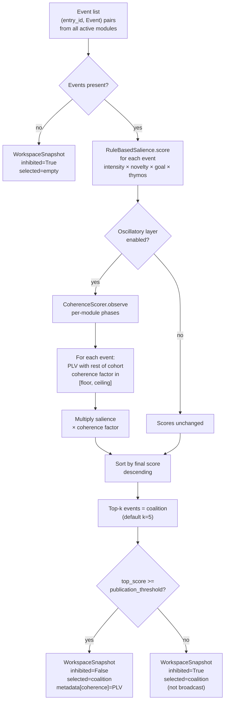
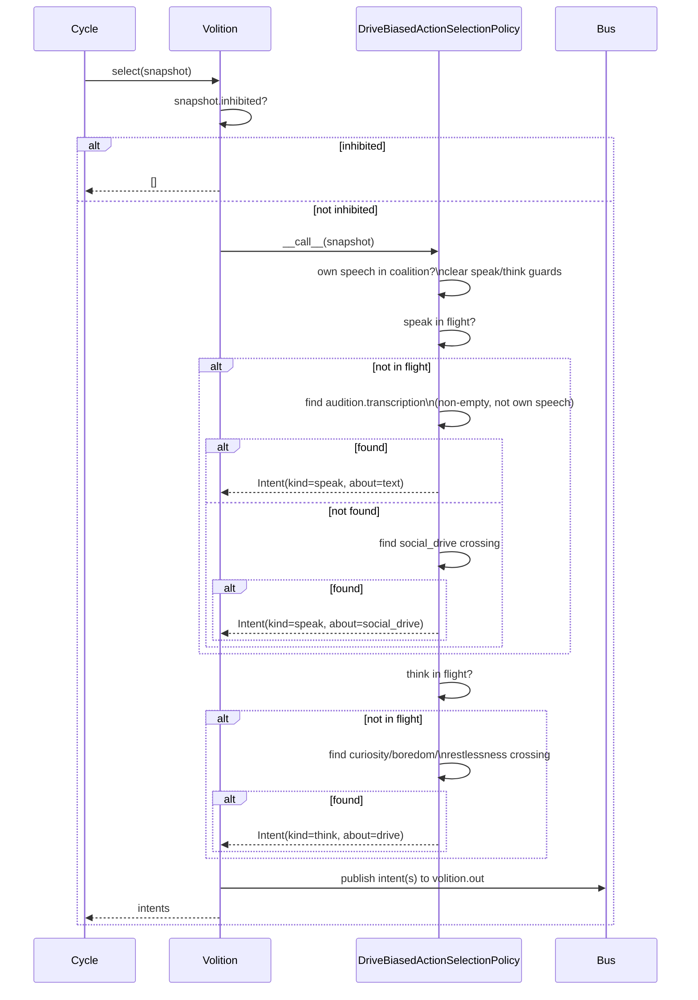

# Process: Global Workspace (Syneidesis)

Syneidesis is KAINE's implementation of Global Workspace Theory (Baars 1988;
Dehaene et al. 2011). Each cognitive-cycle tick it receives all events
published by active modules, scores them by salience and oscillatory coherence,
selects a top-k coalition, and either broadcasts that coalition to all modules
(an "experiential" tick) or sets the inhibition flag (a "silent" tick). It
never decides what the entity should *do* — that is Volition's job.

Related: [cognitive-cycle.md](cognitive-cycle.md) ·
[../architecture.md](../architecture.md)

---

## Selection Pipeline



---

## Salience Scoring — `RuleBasedSalience`

`kaine/workspace/salience.py`

The v1 salience formula is a **product** of four factors, all in [0, 1],
clamped to [0, 1]:

```
score = clamp(intensity × novelty × goal_relevance × thymos_modulation)
```

| Factor | Source | Notes |
|--------|--------|-------|
| `intensity` | `event.salience` (0–1) | The publishing module's self-assessed importance. Validated at publish time. |
| `novelty` | `NoveltyTracker` | Sliding-window deduplication. Repeated events decay toward 0; novel events score 1. Window size configurable (`[syneidesis].novelty_window`, default 32). |
| `goal_relevance` | `GoalScorer` | How aligned this event is with the current drive state. `DriveRelevanceGoalScorer` attenuates events that do not serve the dominant Thymos drive. |
| `thymos_modulation` | `ThymosModulator` | Arousal widens the attentional window (high arousal → scores closer to intensity × novelty). |

**Live factor sources.** The Thymos factor is LIVE by default: the real
arousal-weighted `StateModulator` (`kaine/modules/thymos/modulator.py`) is wired
in via `[syneidesis].salience_thymos_factor = "state_modulator"`. The goal factor
is BUILT (`DriveRelevanceGoalScorer`) but ships on the static fallback
(`[syneidesis].salience_goal_factor = "static"`), staged pending validation on
logged runs — `DriveRelevanceGoalScorer` is an engineering extension of the
paper's under-specified goal function (§3.4.3) and is **not yet validated**, and
enabling it changes what reaches the workspace (shifts the research baseline).
Selecting `static` for either factor is the runnable two-factor negative control
and emits a degraded-mode warning.

Both real factors read the entity's current affect / drives through an
`AffectStateProvider` (`kaine/cycle/affect_state.py`) that the cycle engine
refreshes each tick from the `thymos.state` events it already collects — a
dependency-injection seam, so the workspace layer never imports `kaine.modules`.
Salience stays a pure function of `(event, affect_state, drive_state)` (no
wall-clock, no RNG, no new bus I/O), preserving the deterministic-cycle and
canonical-ordering guarantees.

A module that publishes a low-salience event (e.g. `soma.tick` at 0.05) and
that event is not novel will score near zero and will not enter the coalition.

---

## Oscillatory Coherence Multiplier

`kaine/workspace/coherence.py` — `CoherenceScorer`

This layer is **disabled by default** (`[oscillator].enabled = false`). When
disabled the multiplier is exactly 1.0 and the selection above is the complete
algorithm.

When enabled:

### Phase observation

Each tick Syneidesis receives `context['phases']` — a dict mapping module names
to their current oscillator phase (radians). It calls
`coherence.observe(phases)` which appends each module's phase to a sliding
deque of length `plv_window` (default 10, minimum 10 enforced at construction).

### Phase-locking value (PLV)

PLV between two phase series of length n is:

```
PLV(a, b) = | mean(exp(i*(a_k - b_k))) |
           = hypot(sum(cos(a_k - b_k)), sum(sin(a_k - b_k))) / n
```

Result is in [0, 1]. PLV = 1.0 means perfectly phase-locked; PLV ~ 0.0 means
independent. The **mean pairwise PLV** of a coalition is the average over all
unordered pairs. A single-source coalition has no pair and maps to PLV = 1.0
(never penalized for solitude).

### Coherence factor

PLV is mapped linearly onto `[coherence_floor, coherence_ceiling]`:

```
factor = floor + (ceiling - floor) × PLV
```

Default bounds are `coherence_floor = 0.8`, `coherence_ceiling = 1.25`.

For each candidate event `factor_for_source(source, cohort)` computes the
mean PLV of that source with every other module in the cohort. This gives a
per-event factor reflecting how well *this module* is synchronized with the
rest of the active cohort.

Phase-locked events are boosted toward 1.25×; desynchronized events are
attenuated toward 0.8×. At equal salience a phase-locked coalition wins.

### PLV in snapshot metadata

When the oscillatory layer is enabled, `Syneidesis.select` writes the coalition
PLV to `WorkspaceSnapshot.metadata['coherence']`. This value is carried in
the `workspace.broadcast` payload and consumed by the
`CoherenceObserver` sidecar. When the layer is disabled the key is absent.

### Controls (layer validation)

The coherence layer's toggle is validated by two controls so its enable/disable
behavior is falsifiable rather than assumed:

- **Multi-cycle disabled == absent (bit-for-bit):** a disabled-layer `Syneidesis`
  and a layer-absent baseline are driven through many consecutive cycles with the
  same seed and the same per-cycle events/phases; the selected events, their
  order, the salience scores, and the inhibition flag are identical on EVERY
  cycle, and neither writes `metadata['coherence']`. The disabled multiplier is a
  literal no-op: salience scores equal the raw strategy scores (effective factor
  exactly 1.0), and `factor_from_plv(1.0)` equals the ceiling with the bounded map
  monotone in PLV.
- **Extreme-gain flip (positive):** with the layer enabled at an extreme
  `coherence_ceiling` and a low `coherence_floor`, a phase-locked event carrying
  LOWER raw salience overtakes a desynchronized event carrying HIGHER raw salience
  — selection demonstrably FLIPS relative to the salience-only baseline, proving
  the toggle is firmly connected to the selection mechanism (a stronger claim than
  the moderate-gain "phase-locked coalition wins at equal salience" test).

---

## Inhibition Gate

`inhibited = top_score < publication_threshold` (default threshold 0.35).

An inhibited snapshot:
- Is **not** published to `workspace.broadcast` (the broadcast call is skipped
  in the cycle).
- Produces **no intents** — Volition returns `[]` for any inhibited snapshot
  as its first action (§37/§147 safeguard).
- Still contains the top-k coalition in `selected_events` for diagnostic use,
  but that coalition never reaches modules or effectors.

Inhibition fires in two cases:
1. No events in the input list (empty tick — all modules are quiet).
2. The best-scored event's final score (after coherence multiplication) is
   below `publication_threshold`.

`publication_threshold` is configurable at runtime via
`syneidesis.set_publication_threshold(t)` (called by tests and future
learned-salience changes). The config key is `[syneidesis].publication_threshold`.

---

## Volition — Action Selection

`kaine/workspace/volition.py`

Volition is invoked by the cycle immediately after a successful experiential
broadcast. It is the **only** path from a conscious snapshot to an effector.
Its decision policy is injectable; the policy actually wired at the
composition root (`kaine/cycle/__main__.py`) is
`DriveBiasedActionSelectionPolicy` (`kaine/workspace/drive_policy.py`), not
the base `DefaultActionSelectionPolicy`.



**`DefaultActionSelectionPolicy` safeguards** (inherited by
`DriveBiasedActionSelectionPolicy`):

- Never forms a `speak` intent about an event whose source is `lingua` (no
  self-response feedback loop).
- One-in-flight guard: arms when `speak` is emitted; disarms when a subsequent
  coalition contains `source=lingua` (own external speech observed).
- User communication events are recognized by `source=audition`,
  `type=audition.transcription`, non-empty `payload.text`.

**`DriveBiasedActionSelectionPolicy` additions.** Thymos publishes
`thymos.drive` threshold-crossing events for four drives; this policy turns a
drive crossing that reached the (non-inhibited) conscious coalition into an
intent — closing the loop between motivation and behavior:

- `social_drive` → `speak` (communicative initiative). A present user
  utterance always outranks a social-drive initiative — at most one `speak`
  intent is emitted per call, and `_user_response_intent` is tried first.
- `curiosity` / `boredom` / `restlessness` → `think` (internal deliberation;
  never reaches TTS).
- `speak` and `think` have independent one-in-flight guards, each cleared
  when the entity's own matching output (`source=lingua`, `type=external_speech`
  for `speak` / `type=internal_speech` for `think`) next becomes conscious.
- The entity never responds to its own output (`source=lingua`), for either
  channel.

---

## Intent Signing and the `act`/Praxis Path

`kaine/security/intent_signing.py` · `kaine/modules/praxis/module.py`

Single-process KAINE shares one Redis connection and bus credential across
every module, so the bus alone cannot prove *which* module published an
event. To close that gap for `act` intents specifically — the only intent
kind that reaches a real-world effector — the composition root generates a
per-boot HMAC secret (`generate_intent_secret()`, 32 random bytes, held only
in-process, never published/persisted/logged) and injects it into both
Volition (as an `IntentSigner`) and Praxis.

`Volition._sign` attaches a provenance envelope — `run_id`, a per-signer
monotonic `seq`, and `sig` — to every `act` intent before it is published, via
`IntentSigner.sign()`. `sig` is an HMAC-SHA256 over a canonical
(sorted-keys, compact-separator) serialization of `(kind, effector, params,
run_id, seq)`. Only `act` intents are signed; `speak`/`think` are unchanged
and carry no envelope. `Intent.to_event_payload()` includes `run_id`/`seq`/
`sig` only when they are set (`is not None`, since `seq` may legitimately be
`0`).

Praxis verifies the signature (`verify_intent_signature`) before running any
effector for an `act` intent it reads off `volition.out`; a forged or
unsigned intent from a writer that does not hold the secret fails
verification and is dropped. The `(run_id, seq)` pair is also a replay guard.
This is a **second** boundary alongside the operator's effector-enablement and
per-effector command whitelists — it does not replace them.

---

## Event Types and Streams

| Stream | Direction | Events |
|--------|-----------|--------|
| `<module>.out` | module → bus | All module outputs |
| `workspace.broadcast` | Syneidesis → bus | `snapshot` JSON field (no Event wrapper) |
| `volition.out` | Volition → bus | `intent.speak`, `intent.think`, `intent.act` |
| `cycle.control` | operator → bus | `cycle.set_rates` |
| `cycle.out` | cycle → bus | `cycle.tick`, `cycle.rates` |

Modules subscribe to `workspace.broadcast` via
`AsyncBus.subscribe_workspace(last_id="$")` — this resolves `"$"` to the
current latest entry ID (via `XREVRANGE`) so that tests against fakeredis
work correctly (the standard Redis `"$"` sentinel is unreliable in
fakeredis).

---

## Configuration Reference

See [configuration.md](../configuration.md) for the full config file. Relevant
keys:

```toml
[syneidesis]
top_k = 5
publication_threshold = 0.35
novelty_window = 32

[oscillator]
enabled = false
plv_window = 10
coherence_floor = 0.8
coherence_ceiling = 1.25
population_size = 16
beta = 0.9
threshold = 1.0
base_drive = 1.5
```

---

## Safety / Zero-Persistence Notes

- `CoherenceScorer` phase buffers are **ephemeral**: `defaultdict(deque)` in
  RAM, not serialized. Phase windows re-initialize to the neutral phase on
  restart. This is load-bearing: no oscillatory state is ever persisted.
- `WorkspaceSnapshot` objects are not persisted. The `workspace.broadcast`
  stream holds the serialized payload; the stream is trimmed to 50,000
  entries by approximate MAXLEN.
- The `metadata['coherence']` field in broadcast payloads contains only the
  scalar PLV float — no sensory content.

---

## Key Files

| File | Role |
|------|------|
| `kaine/workspace/syneidesis.py` | `Syneidesis` — main selection logic |
| `kaine/workspace/salience.py` | `RuleBasedSalience` — product-form scorer |
| `kaine/workspace/coherence.py` | `CoherenceScorer`, `phase_locking_value`, `mean_pairwise_plv` |
| `kaine/workspace/volition.py` | `Volition`, `DefaultActionSelectionPolicy`, `Intent` |
| `kaine/workspace/drive_policy.py` | `DriveBiasedActionSelectionPolicy` — the wired policy; turns a non-inhibited `thymos.drive` crossing into a `speak` (social_drive) or `think` (curiosity/boredom/restlessness) intent |
| `kaine/workspace/strategies.py` | `GoalScorer`, `ThymosModulator` protocols |
| `kaine/workspace/novelty.py` | `NoveltyTracker` sliding-window deduplication |
| `kaine/oscillator/` | `ModuleOscillator`, `FakeOscillator`, `NEUTRAL_PHASE` |
| `kaine/security/intent_signing.py` | `IntentSigner`, `generate_intent_secret`, `verify_intent_signature` — `act`-intent provenance/replay guard |
| `kaine/cycle/types.py` | `WorkspaceSnapshot` dataclass |
