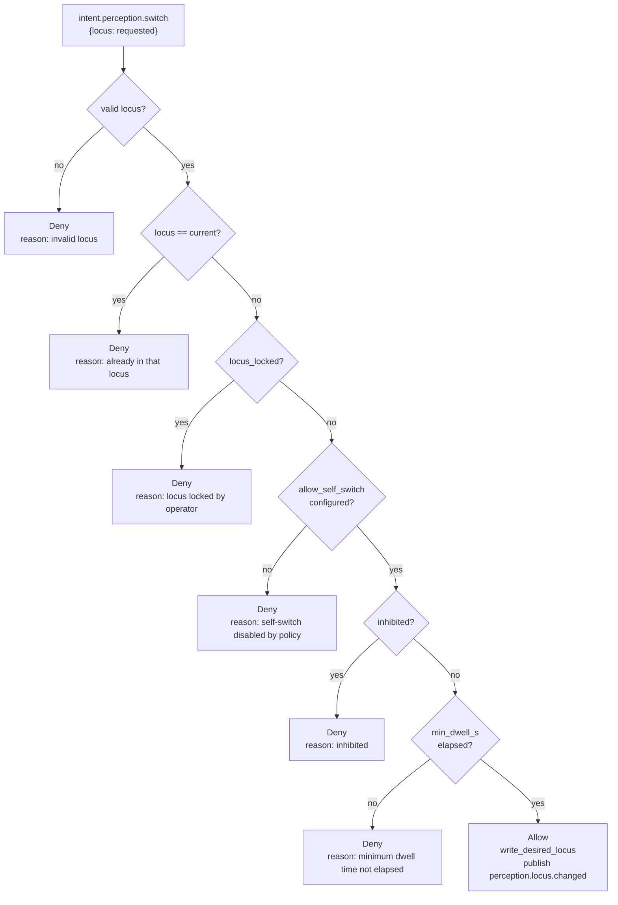

# Process: Perception Locus

The perceptual locus is KAINE's model of *which world* its sensory organs
(Topos for vision, Audition for hearing) are bound to at any given moment.
It enforces a mutual-exclusion guarantee: the real camera and microphone
can only run when the locus is `physical`. When the locus is `virtual` or
`off`, the real sensors are dark regardless of any other configuration.

This guarantee is **load-bearing for privacy**: the real camera and
microphone are never active while the entity is "away" in a virtual world.

Related: [modules/audition.md](../modules/audition.md) ·
[modules/topos.md](../modules/topos.md) ·
[processes/sleep-maintenance.md](sleep-maintenance.md) ·
[../architecture.md](../architecture.md)

---

## Locus Values

Three loci are defined in `kaine/perception_state.py`:

| Locus | Meaning | Real camera/mic |
|-------|---------|----------------|
| `physical` | The entity perceives the room — real camera and microphone | Allowed (subject to desired-state flags) |
| `virtual` | The entity perceives a virtual source — the deterministic perception feed (seeded/playlist), or an embodied avatar feed (e.g. Mundus) when that path is wired in | Forced off |
| `off` | No perception | Forced off |

Invalid locus strings (not in `("physical", "virtual", "off")`) are coerced
to `"physical"` at read time so the camera and microphone can never be left
in an unknown state.

---

## State Files

Two files under `state/perception/` carry the locus state:

### `state/perception/desired.json`

Written by:
- Nexus `POST /diagnostics/perception/toggle` (operator)
- `PerceptionLocus` module (entity self-switch, gated — see below)

Contains **operator's commanded state**:

```json
{
  "audio_live_desired": false,
  "video_live_desired": false,
  "locus": "physical",
  "locus_locked": false
}
```

`locus_locked = true` prevents the entity from self-switching (operator can
still switch directly). The perception tasks (LiveMicrophone, LiveCamera)
poll this file and start/stop themselves to match.

### `state/perception/runtime.json`

Written by the perception tasks on every start/stop. Source of truth for
the Nexus on-air banner and sidecar observers:

```json
{
  "audio_live_active": false,
  "video_live_active": false,
  "audio_last_started_at": null,
  "video_last_started_at": null,
  "audio_last_stopped_at": null,
  "video_last_stopped_at": null
}
```

Both files contain **only operational booleans and ISO timestamps**. Never
any sensory content (no transcribed text, no audio bytes, no frame data,
no video).

---

## Effective Capture Logic

The two helper functions in `kaine/perception_state.py` enforce the locus
gate:

```python
def effective_audio_capture(path=None) -> bool:
    d = read_desired(path)
    return d.audio_live_desired and d.locus == "physical"

def effective_video_capture(path=None) -> bool:
    d = read_desired(path)
    return d.video_live_desired and d.locus == "physical"
```

Even if `audio_live_desired = True`, the microphone does not run when
`locus != "physical"`. The perception tasks call these functions to
decide whether to start/maintain capture.

`kaine/perception_state.py` also defines the virtual-locus mirrors of these
two functions:

```python
def effective_virtual_audio_capture(path=None) -> bool:
    d = read_desired(path)
    return d.audio_live_desired and d.locus == "virtual"

def effective_virtual_video_capture(path=None) -> bool:
    d = read_desired(path)
    return d.video_live_desired and d.locus == "virtual"
```

These gate the deterministic perception feed (seeded/playlist) exactly as
`effective_audio_capture`/`effective_video_capture` gate the real mic/camera,
but on `locus == "virtual"` instead of `"physical"` — the same
`audio_live_desired`/`video_live_desired` flags still apply, so the operator
mute toggle works on the virtual feed too. `Audition`'s and `Topos`' modules
poll these mirrors the same way the real-sensor tasks poll the physical ones.

`select_virtual_feed()` (also in `kaine/perception_state.py`) is the boot-time
helper that rezzes the entity into the `virtual` locus with both modalities
desired, whenever `[perception_feed].mode` is configured to `seeded` or
`playlist` (see below) — a configured deterministic feed IS the entity's
world, so booting with one selected must actually bind the senses to it. It
honours `locus_locked`: if the operator has locked the locus, the configured
feed is left unbound and the unchanged desired-state is returned.

---

## Operator-Initiated Locus Switch

The Nexus `POST /diagnostics/perception/locus` endpoint writes the new locus
to `desired.json` directly via `write_desired_locus()`. This bypasses all
policy gates — the operator always has direct control.

---

## Entity Self-Switch

`kaine/modules/perception/module.py` — `PerceptionLocus`

The entity may request a locus switch by emitting an `intent.perception.switch`
intent via Volition. The `PerceptionLocus` module watches `volition.out` for
this event type and applies the `evaluate_locus_switch` policy gate below.

**This path is currently an unreachable producer gap.** The `PerceptionLocus`
module is a real consumer/handler for `intent.perception.switch`, and the
gating logic below is real and tested, but nothing in the current codebase
emits that event: Volition only emits `intent.speak`, `intent.think`, and
`intent.act`. Until a producer lands (deferred to virtual-world embodiment work),
the entity cannot self-switch in practice, and `allow_self_switch` should stay
at its default of `false`. Locus changes are operator-driven (via Nexus) until
then. The gate:



**Gate parameters:**

| Parameter | Default | Config |
|-----------|---------|--------|
| `allow_self_switch` | `false` | `PerceptionLocus` constructor |
| `min_dwell_s` | `30.0` s | `PerceptionLocus` constructor |

On allow: writes `desired.json` with the new locus and publishes
`perception.locus.changed` to `perception.out`.

On deny: publishes `perception.locus.denied` to `perception.out` with the
reason.

The entity cannot self-switch when:
- The cycle snapshot is inhibited (belt-and-suspenders — Volition already
  suppresses intents on inhibited snapshots, but the module tracks inhibition
  independently).
- `locus_locked = true` was set by the operator.
- `allow_self_switch = false` (the default — operators must explicitly enable
  self-switching).
- The minimum dwell time since the last switch has not elapsed.

---

## Locus and Sleep Maintenance

During Hypnos Phase 2 (deep consolidation), external perception is suspended
while memory traces are replayed into the workspace. This suspension uses the
same locus machinery:

- `suspend_perception()` — called at the start of the replay window
- `restore_perception()` — always called in a `finally` block

This ensures the entity cannot simultaneously be perceiving the room and
re-processing memory traces, and that perception is never left suspended
even if the replay phase raises.

---

## Event Types

| Event type | Stream | Condition |
|------------|--------|-----------|
| `perception.locus.changed` | `perception.out` | Entity self-switch succeeded |
| `perception.locus.denied` | `perception.out` | Entity self-switch was denied |

Operator-initiated switches write directly to `desired.json` without a bus
event (the Nexus endpoint handles this synchronously).

---

## Zero-Persistence Invariant

All files under `state/perception/` contain only:
- Operational booleans (`audio_live_active`, `video_live_desired`, etc.)
- ISO-8601 timestamps (start/stop times)
- The locus string (`"physical"`, `"virtual"`, `"off"`)
- The lock boolean

They never contain:
- Transcribed text
- Audio bytes or audio metadata
- Video frames or frame metadata
- Any sensory content

Raw camera frames (Topos) and raw audio (Audition) are processed in memory
and released. No frame or audio sample ever touches disk.

---

## Virtual Locus: Deterministic Perception Feed

Setting `locus = "virtual"` forces the real camera and microphone off (via
`effective_audio_capture` / `effective_video_capture`), so the physical
environment cannot be monitored while the entity is perceiving a virtual
source. The default locus is `"physical"`.

The `virtual` locus is gated purely on the top-level `[perception_feed].mode`
config key — there is **no dependency on the Mundus module**. Whenever
`[perception_feed].mode` is `seeded` or `playlist` (and either `topos` or
`audition` is enabled), boot calls `select_virtual_feed()` to rez the entity
directly into the `virtual` locus with both modalities desired (see above).
Mundus (`kaine/modules/mundus/` — the body-agnostic embodiment control plane) is
an unrelated, separately-gated module; it is not required for, and does not
gate, virtual-locus availability.

`[perception_feed].mode` selects the actual source bound to the virtual
locus:

- `seeded` — `SeededProceduralSource` (`kaine/modules/topos/feed.py`). Its
  `frame_at(frame_index)` is a pure, unbounded function of `(seed,
  frame_index)` — there is no time cutoff; it can run for as long as the tick
  loop keeps calling it. It needs no external media, but it is candidly
  unlikely to be research-grade stimulus: it is procedural noise (a
  seed-derived slow drift plus periodic seeded "surprise" events), not
  naturalistic content.
- `playlist` — `PlaylistSource` (`kaine/modules/topos/feed.py`), the shipped,
  intended eventual replacement for `seeded`: an operator-curated, openly-
  licensed media corpus pinned by one checksummed manifest
  (`playlist_manifest`), advancing clip-by-clip; a digest mismatch fails the
  run closed.

None of the project's research experiments depend on live or generated
perception — the seeded/playlist feed is a stimulus-delivery convenience for
demos and shakedowns, not a dependency of the experiment battery itself.

---

## Configuration Reference

The locus VALUE itself (`physical`/`virtual`/`off`) is set at runtime, not in
`kaine.toml` — via Nexus (operator) or, once a producer exists, the
`PerceptionLocus` module's self-switch path (see above). But `kaine.toml`
DOES have a `[perception]` section, which configures the `PerceptionLocus`
module's gate parameters:

```toml
[perception]
allow_self_switch = false
min_dwell_s = 30.0
```

This section is consumed by `boot.make_perception()` (`kaine/boot.py`), which
is registered as the `"perception"` module factory and reads `[perception]`
into the `PerceptionLocus` constructor:

```python
def make_perception(bus, section, *, entity_clock=None):
    kwargs = {}
    for key in ("allow_self_switch", "min_dwell_s"):
        if key in section:
            kwargs[key] = section[key]
    return PerceptionLocus(bus, entity_clock=entity_clock, **kwargs)
```

The perception module is toggled via:

```toml
[modules]
perception = false   # shipped default; set true to enable PerceptionLocus
# Note: the perception module in kaine.toml refers to PerceptionLocus.
# The actual perception tasks (LiveMicrophone, LiveCamera) are part of
# audition and topos respectively.
```

State files:
- `state/perception/desired.json` — operator's commanded state
- `state/perception/runtime.json` — live capture state (on-air banner source)

---

## Key Files

| File | Role |
|------|------|
| `kaine/perception_state.py` | `PerceptionState`, `DesiredState`, locus coercion, `effective_audio_capture`, `effective_video_capture`, `evaluate_locus_switch` |
| `kaine/modules/perception/module.py` | `PerceptionLocus` — entity self-switch gating, intent consumer |
| `kaine/modules/audition/` | `LiveMicrophone` — polls desired state, calls `effective_audio_capture` |
| `kaine/modules/topos/` | `LiveCamera` — polls desired state, calls `effective_video_capture` |
| `kaine/nexus/` | Operator toggle endpoints (`POST /diagnostics/perception/toggle`, `POST /diagnostics/perception/locus`) |
| `state/perception/desired.json` | Operator-commanded locus + sensor flags |
| `state/perception/runtime.json` | Live capture status (operational booleans only) |
