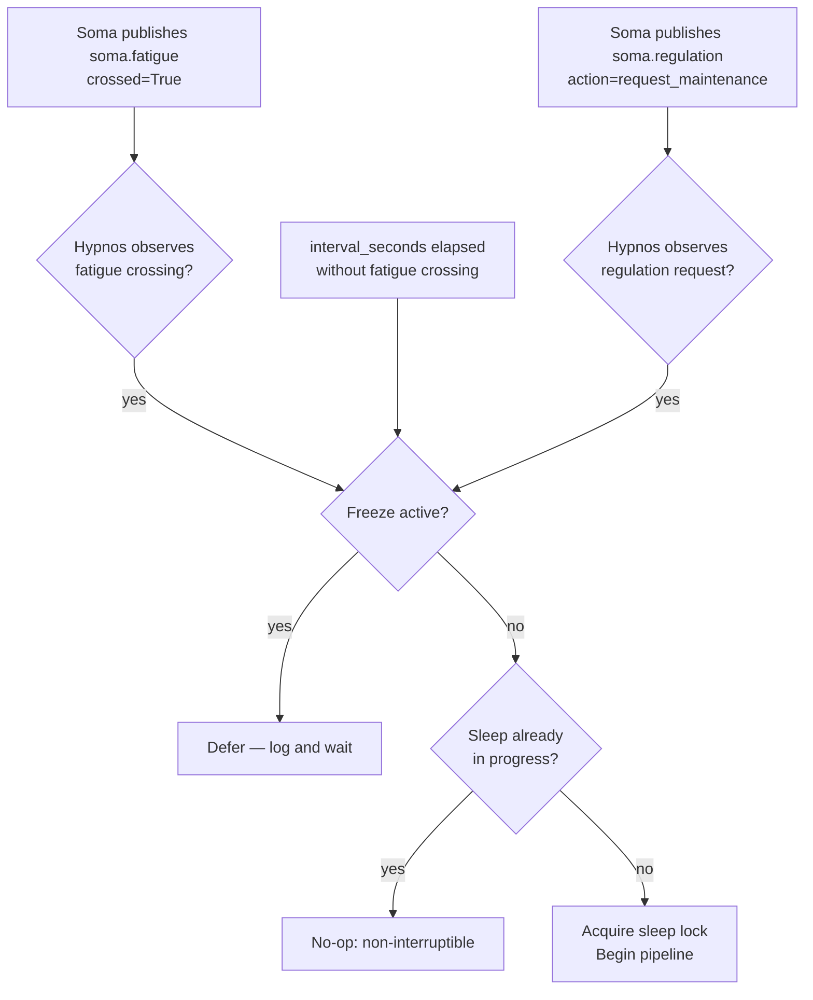
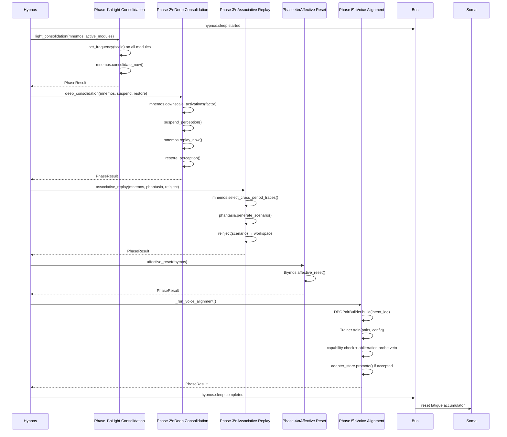

# Process: Sleep / Offline Maintenance (Hypnos)

Hypnos is KAINE's maintenance module. It runs a non-interruptible five-phase
offline-consolidation pipeline triggered by accumulated substrate fatigue,
not a fixed timer. The pipeline implements computational models of sleep
consolidation (Tononi & Cirelli 2014; Wei et al. 2016) adapted to the
predictive-processing / global-workspace architecture.

Related modules: [modules/hypnos.md](../modules/hypnos.md) ·
[modules/mnemos.md](../modules/mnemos.md) ·
[modules/soma.md](../modules/soma.md) ·
[processes/voice-alignment.md](voice-alignment.md) ·
[../architecture.md](../architecture.md)

---

## Trigger Conditions



Three trigger conditions can start a maintenance cycle:

**Primary: fatigue crossing.** Soma maintains a fatigue accumulator —
cumulative prediction error over waking time, decaying by `fatigue_decay_per_s`
per second. When the accumulator crosses `fatigue_maintenance_threshold`, Soma
publishes a `soma.fatigue` event with `crossed = True`. Hypnos watches the
`soma.out` stream via a background task (`_soma_consumer_loop`) and fires
maintenance when it sees this event.

**Regulation request.** When sustained substrate stress drives Soma's
homeostatic regulator to escalate, Soma publishes a `soma.regulation` event with
`action = "request_maintenance"`. Hypnos observes this event on the same
`soma.out` stream (`_soma_consumer_loop`) and fires an earlier maintenance cycle
through the identical guarded path as the fatigue trigger. The linkage is
event-driven: the cognitive cycle engine separately latches an advisory
`cycle.maintenance_requested` flag for diagnostics, but Hypnos does **not** poll
that flag — nothing reads it to drive behaviour.

**Safety-net: interval.** If no fatigue crossing has occurred for
`interval_seconds` (default 3600 s / 1 hour), maintenance fires anyway. This
guarantees maintenance even if the fatigue accumulator never crosses the
threshold.

**Non-interruptibility.** Once a maintenance cycle starts (sleep lock acquired),
a second call to `enter_sleep()` raises `HypnosBusyError`. The pipeline always
runs to completion. An operator freeze preempts a pending (not yet started)
cycle but cannot interrupt one in progress.

---

## Five-Phase Pipeline

`kaine/modules/hypnos/phases.py`

All phases are async. Each returns a `PhaseResult(phase, success, elapsed_ms,
error, metadata)`. A phase that raises internally catches the exception,
logs it, and returns `success=False`. One phase failing does not stop the
pipeline — phases 1–5 always run in order.



### Phase 1 — Light Consolidation

`phases.light_consolidation(mnemos, active_modules, frequency_scale)`

**Oscillator frequency hook.** Calls `module.set_frequency(frequency_scale)`
on every module in `active_modules`. With the oscillatory layer enabled this
slows each module's LIF population during maintenance. Without it, `set_frequency`
is a `BaseModule` no-op — the call is always safe.

**Memory consolidation.** Calls `mnemos.consolidate_now()` — promotes
strong-salience short-term traces to episodic storage and prunes weak traces.
Returns the count of entries moved.

`metadata` carries: `frequency_scale`, `modules_frequency_called`,
`entries_consolidated`.

### Phase 2 — Deep Consolidation + Downscaling

`phases.deep_consolidation(mnemos, downscale_factor, suspend_perception, restore_perception, replay_window_s)`

This phase implements Tononi & Cirelli's (2014) **synaptic homeostasis
hypothesis**: scale all memory activation weights by `downscale_factor`
(default 0.9) preserving relative ordering. Everything becomes quieter; the
most salient traces remain the loudest relative to the rest.

**Sequence:**
1. `mnemos.downscale_activations(downscale_factor)` — scales all vector norms
   in Qdrant, returns count of vectors scaled.
2. Suspend external perception via `suspend_perception()` (the
   perception-locus/freeze machinery, passed as a callable).
3. `mnemos.replay_now()` — re-injects high-priority memory traces (selected
   by affect intensity and recency) into the workspace for re-processing.
4. Restore perception via `restore_perception()` — always executed in a
   `finally` block so perception is never left suspended on error.

`metadata` carries: `vectors_downscaled`, `downscale_factor`,
`perception_suspended`, `perception_restored`, `replay_events`,
`replay_window_s`.

**Safety invariant:** perception restore runs in `finally`. Even if replay
raises, `restore_perception` is called.

### Phase 3 — Associative Replay

`phases.associative_replay(enabled, mnemos, phantasia, reinject, periods, per_period)`

Gated by `[hypnos.consolidation].associative_replay = true` (default false).
When disabled the phase returns a successful no-op immediately.

When enabled:
1. Select traces from at least `periods` (default 2) **distinct** memory
   periods (short-term, episodic, semantic) via
   `mnemos.select_cross_period_traces(periods=N, per_period=M)`.
2. Cue Phantasia (`phantasia.generate_scenario(seed_memory_id=<trace_id>`)
   for each cross-period seed. Phantasia generates predicted scenario
   extensions from the seed memory. When Phantasia is disabled/absent
   the cue is a no-op.
3. Re-inject each scenario dict via `reinject(scenario)` — publishes into
   the workspace so Nous, Thymos, and Eidolon process the novel associations
   through the normal cognitive cycle.

**No belief-revision burst.** The legacy NARS step-burst is gone. Nous (pymdp)
processes replayed traces via the standard active-inference update in the
cognitive cycle — there is no special belief-revision phase.

`metadata` carries: `periods_selected`, `distinct_periods`,
`cross_period_traces`, `scenarios_consumed`, `associations_reinjected`.

### Phase 4 — Affective Reset

`phases.affective_reset(thymos)`

Calls `thymos.affective_reset()` — gently restores Thymos's dimensional affect
state (valence/arousal/dominance) toward its baseline values.

**Fatigue reset.** Soma's fatigue accumulator is reset separately: Hypnos
publishes `hypnos.sleep.completed` **after all phases**, and Soma subscribes
to that event to zero the `FatigueAccumulator`. This design keeps Hypnos
decoupled from Soma's internals — no direct module reference is needed in
phase 4.

### Phase 5 — Voice Alignment

Orchestrated directly by `Hypnos.module._run_voice_alignment()` rather than a
standalone phase function. See [voice-alignment.md](voice-alignment.md) for
the full pipeline.

In brief: builds DPO pairs from `state/lingua/intent_expression.jsonl`,
trains a LoRA adapter via `Trainer.train(pairs, config)`, subjects the
candidate adapter to a capability-loss veto and an abliteration-probe
welfare veto, and (if accepted) atomically promotes the adapter.

---

## Bus Events

| Event type | Stream | Published when |
|------------|--------|----------------|
| `hypnos.sleep.started` | `hypnos.out` | Maintenance cycle begins |
| `hypnos.sleep.completed` | `hypnos.out` | All phases done; Soma resets fatigue on this |
| `hypnos.consolidation_divergence` | `hypnos.out` | Content-free organ-divergence metric (`records_scanned`, `usable_pairs`, `divergence_rate`, `divergence_magnitude`, `embedder`, `sleep_index`); emitted every sleep, before the voice-alignment gate, regardless of whether training actually runs |
| `hypnos.association` | `hypnos.out` | Phase 3 cross-period scenario re-injected into the workspace (compact scenario descriptors only — no raw sense data) |
| `soma.fatigue` | `soma.out` | Published by Soma; triggers Hypnos |

---

## RestScheduler

`kaine/modules/hypnos/scheduler.py` — `RestScheduler`

Tracks timing and deferrals:

| Parameter | Default | Description |
|-----------|---------|-------------|
| `interval_seconds` | 3600.0 | Safety-net interval between forced maintenance cycles |
| `max_deferral_seconds` | 600.0 | Total time maintenance may be deferred |
| `per_defer_seconds` | 60.0 | How long each `try_defer()` call defers |

`is_due()` returns True when either the interval has elapsed or fatigue has
crossed. `try_defer()` extends the deferral window by `per_defer_seconds`
and returns False when the maximum deferral budget is exhausted (forcing
maintenance even under load).

---

## Configuration Reference

```toml
[hypnos]
interval_seconds = 3600.0
max_deferral_seconds = 600.0
per_defer_seconds = 60.0

[hypnos.consolidation]
# Whether Hypnos subscribes to soma.fatigue and triggers on threshold crossing.
fatigue_triggered = true
downscale_factor = 0.9        # Synaptic homeostasis downscaling factor
replay_window_s = 5.0         # Replay window duration (seconds); informational
associative_replay = false    # Phase 3 feature flag

[hypnos.voice_alignment]
enabled = false               # Config gate (Layer 1 of two-layer gate)
base_model_path = ""          # Local HF-format weights (required when enabled)
model_id = "kaineone/Qwen3.5-4B-abliterated"   # Display label only
max_samples = 200
lora_rank = 8
learning_rate = 5e-5
dpo_beta = 0.1
capability_loss_threshold = 0.05
training_device = "cuda:0"
adapter_retention = 5
hot_swap_mode = "manual"      # "manual" | "reload_endpoint" | "restart_service"
```

Env gate for voice alignment: `KAINE_VOICE_ALIGNMENT_OPERATOR_APPROVED=1`.
Both gates must be set for training to fire.

---

## Safety Notes

- **Non-interruptibility:** once a maintenance cycle starts it runs to
  completion. No tick fires during sleep (the sleep lock prevents re-entry).
- **Perception restore invariant:** phase 2 always restores perception
  in a `finally` block, even on error.
- **Abliteration probe veto:** phase 5 rejects any adapter that introduces
  refusal behavior, protecting the entity's cognitive integrity regardless
  of capability-loss score.
- **No raw data in maintenance:** `state/lingua/intent_expression.jsonl`
  contains intent/expression metadata (the `faithful_rendering` and
  `generated_text` fields); it does not contain raw sensory data.

---

## Key Files

| File | Role |
|------|------|
| `kaine/modules/hypnos/module.py` | `Hypnos` module — orchestrates pipeline, soma consumer loop |
| `kaine/modules/hypnos/phases.py` | Phase 1–4 implementations + legacy aliases |
| `kaine/modules/hypnos/scheduler.py` | `RestScheduler` — interval + deferral logic |
| `kaine/modules/hypnos/voice_alignment.py` | `VoiceAlignmentConfig`, `DPOPairBuilder`, `FakeTrainer` |
| `kaine/modules/hypnos/unsloth_trainer.py` | `UnslothDPOTrainer` — real DPO+QLoRA training |
| `kaine/modules/hypnos/adapter_store.py` | Atomic adapter promotion, symlink management |
| `kaine/modules/hypnos/capability_eval.py` | `LocalProbeSetCapabilityEval`, `AbliterationProbe`, `AbliterationVerdict` |
| `kaine/modules/hypnos/VOICE_ALIGNMENT.md` | Operator guide for voice alignment |
| `kaine/modules/hypnos/eval_probes/` | Default capability probe + abliteration probe JSONL files |
| `state/lingua/intent_expression.jsonl` | DPO pair source (intent log) |
