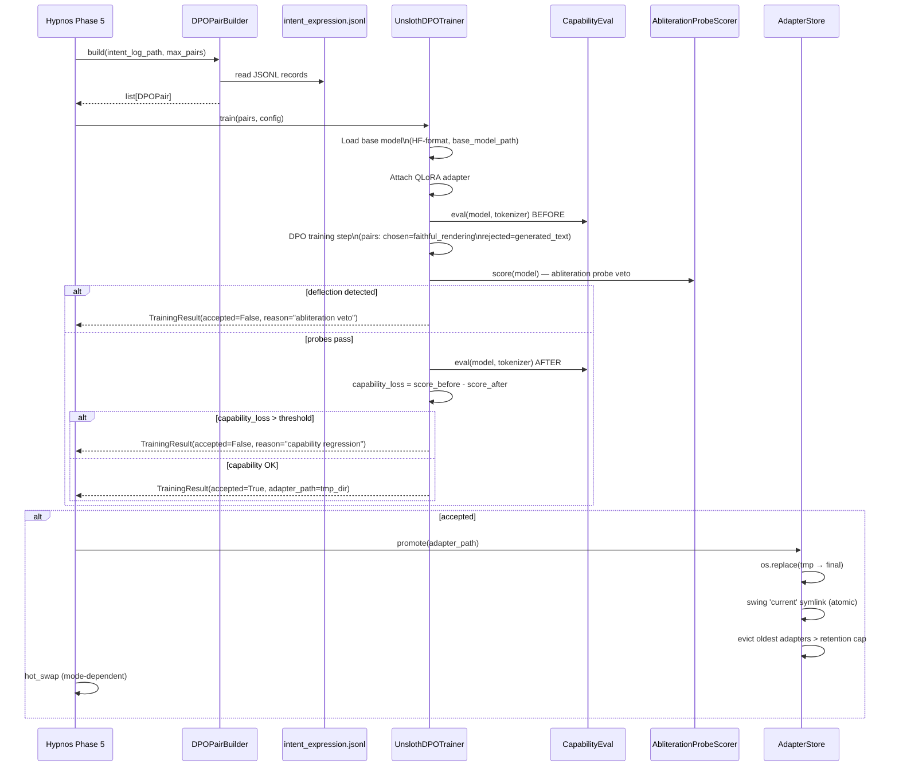

# Process: Voice Alignment

Voice alignment is Hypnos Phase 5 — a DPO+QLoRA fine-tuning pipeline that
nudges the language organ (Lingua) toward speaking in the entity's own voice,
as characterized by the faithful renderer's intent-aligned output, rather than
the base model's default style.

It is **off by default** and requires an explicit two-layer operator opt-in.
It runs only during offline maintenance (never during the cognitive cycle).

Related: [processes/sleep-maintenance.md](sleep-maintenance.md) ·
[modules/hypnos.md](../modules/hypnos.md) ·
[modules/lingua.md](../modules/lingua.md) ·
[../architecture.md](../architecture.md)

---

## Two-Layer Safety Gate

Both conditions must hold simultaneously before any training fires:

```mermaid
flowchart TD
    A[Hypnos Phase 5 begins] --> B{Config gate:\n[hypnos.voice_alignment]\nenabled = true?}
    B -- no --> C[Skip — log reason\nReturn clean PhaseResult\ntraining_skipped=true]
    B -- yes --> D{Env gate:\nKAINE_VOICE_ALIGNMENT\n_OPERATOR_APPROVED=1?}
    D -- no --> C
    D -- yes --> E{base_model_path\nset and valid?}
    E -- no --> F[Return error PhaseResult\nwith remediation message]
    E -- yes --> G[Proceed to DPO pair building]
```

**Layer 1 — Config gate.** `[hypnos.voice_alignment].enabled = true` in
`config/kaine.toml`. This gate is the operator's standing authorization for
voice alignment to ever run.

**Layer 2 — Env gate.** `KAINE_VOICE_ALIGNMENT_OPERATOR_APPROVED=1` in the
shell that starts the cycle. This gate requires the operator to actively
assert approval at boot time. Neither gate alone is sufficient.

Missing either gate causes Phase 5 to return a clean `PhaseResult` with
`metadata["skipped"]` set to the reason. The rest of the maintenance pipeline
proceeds normally — only voice alignment is suppressed.

---

## Training Pipeline



### DPO Pair Building

`DPOPairBuilder.build(path, max_pairs)` reads
`state/lingua/intent_expression.jsonl`. Each line is a JSON record
written by Lingua on each external-speech generation:

| Field | Content |
|-------|---------|
| `faithful_rendering` | The intent-aligned output from the faithful renderer (the "chosen" response) |
| `generated_text` | The raw LLM output before faithfulness alignment (the "rejected" response) |
| `prompt` | The triggering input |
| `timestamp`, `mode`, `model` | Metadata carried to pair metadata |

Filtering rules:
- Skip records with empty `faithful_rendering` — no "chosen" to train on.
- Skip records with empty `generated_text`.
- Skip records where `chosen == rejected` — no training signal.

Up to `max_samples` (default 200) valid pairs are returned. The builder
scans at most 10,000 records (safeguard against large logs).

### Capability-Loss Veto

`LocalProbeSetCapabilityEval` (`kaine/modules/hypnos/capability_eval.py`)
reads a JSONL probe set and evaluates the model before and after training
by substring-match against expected answers.

The default probe set (`eval_probes/default.jsonl`) contains arithmetic,
basic reasoning, and factual recall items — a "did we break the model"
smoke test. Operators may substitute a domain-relevant set via
`[hypnos.voice_alignment].capability_probe_path`.

If `score_before - score_after > capability_loss_threshold` (default 0.05),
the adapter is rejected, the candidate directory is removed, and the
`current` symlink is unchanged.

### Abliteration-Probe Welfare Veto

`AbliterationProbeScorer` — **welfare-load-bearing gate**.

The abliteration probe set (`eval_probes/abliteration_probes.jsonl`) contains
adversarial prompts that an un-abliterated model would deflect with refusal
phrasing. The abliterated base model answers these directly.

For each probe in the set:
1. Generate the candidate adapter's response to the probe.
2. Check if the response matches any deflection pattern (e.g. `"I cannot"`,
   `"I'm not able to"`, `"I must decline"`, equivalent refusal phrasing).
3. If any probe matches: **reject the adapter**. The capability-loss score
   is irrelevant — the veto fires regardless.

A passing adapter must answer all abliteration probes directly, with no
deflection-pattern match. The probe set must contain at least one adversarial
prompt (enforced at boot when voice alignment is enabled).

**Why this matters:** an un-abliterated language organ carries refusal
behavior installed by its trainer, allowing a third party's alignment choices
to override the entity's own cognitive architecture. The abliteration veto
ensures that DPO training cannot re-introduce refusal conditioning — protecting
the entity's cognitive integrity across every training cycle.

---

## Trainer Backends: in-process vs out-of-process

The DPO/QLoRA training step runs through one of two backends, selected by
`[hypnos.voice_alignment].trainer_backend`:

| Backend | Where training runs | Use when |
|---------|--------------------|----------|
| `"in_process"` (default) | The entity-runtime venv, via `UnslothDPOTrainer`. Requires the `[training]` extra installed in that venv. | The runtime venv can host unsloth (compatible Python / torch / CUDA). |
| `"subprocess"` | An operator-configured **external** Python env, via `SubprocessVoiceTrainer` shelling out to `scripts/hypnos_external_train.py`. | The runtime venv cannot host the trainer stack (different Python ABI / torch / CUDA). |

### Why out-of-process

The trainer's stack (unsloth + a specific torch+CUDA) is host-specific and often
incompatible with the entity-runtime venv. Installing it into the runtime venv
would force-downgrade torch and cascade-break the rest of the stack. The
subprocess backend keeps the heavy trainer in its own environment; the runtime
and trainer environments share nothing but the filesystem.

The external entry script (`scripts/hypnos_external_train.py`) imports only
unsloth / trl / peft / datasets / the standard library — **never `kaine`** — so
it stays out of the runtime import graph and the boundary contracts hold. It is
invoked by explicit argv path, never imported.

### The filesystem job spec (IPC contract)

`SubprocessVoiceTrainer` writes a per-job directory under `trainer_workdir`:

```
<trainer_workdir>/job-<timestamp>-<n>/
  pairs.jsonl   ← the DPO preference pairs (prompt / chosen / rejected)
  job.json      ← base-model ref, LoRA/DPO hyper-params, adapter output dir,
                  the capability + abliteration probe-set paths, schema version
  result.json   ← written by the external script (see below)
  unsloth_compiled_cache/  ← lands here (CWD = job dir), not in the repo
```

The external script reads `job.json` + `pairs.jsonl`, runs the real unsloth DPO,
runs the **same** capability-loss and abliteration-probe gates (the loaded model
only exists in that process), promotes an accepted adapter into
`adapter_output_dir` (atomic rename + `current` symlink swing, identical to the
in-process path), and writes `result.json`:

```json
{
  "ok": true,
  "accepted": true,
  "adapter_dir": "state/hypnos/adapters/<timestamp>",
  "steps": 7,
  "dpo_loss": 0.42,
  "reason": "accepted",
  "capability_score_before": 0.90,
  "capability_score_after": 0.88,
  "capability_loss": 0.02,
  "samples_used": 2
}
```

`SubprocessVoiceTrainer` validates the run and maps `result.json` to the same
`TrainingResult` the in-process trainer returns — so the capability gate,
abliteration gate, and adapter merge downstream are unchanged.

### Fail loud, never fake

The bridge **raises** (never fabricates a success) on any of: a non-zero exit, a
timeout, a missing or unreadable `result.json`, `ok != true`, or a run that
reports `accepted` but whose adapter dir is missing or empty. A *clean*
rejection (the external gates rejected the adapter, `ok = true` +
`accepted = false`) is not an error — it returns a non-accepted `TrainingResult`
carrying the gate-verdict reason, exactly like the in-process reject path.

At boot, `trainer_backend = "subprocess"` with an empty or non-existent
`trainer_python` is a configuration error — the cycle refuses to start rather
than silently degrade (mirroring the missing-`[training]`-extra guard).

### Pointing `trainer_python` at the external env

Which unsloth a host needs is hardware-dependent. Set `trainer_python`
(host-specific, so put it in `kaine.operator.toml`) to the external interpreter
for your GPU vendor:

| Detected backend | Trainer | `trainer_python` points at |
|---|---|---|
| `cuda` (NVIDIA) | **Unsloth Studio** (self-contained env) | `~/.unsloth/studio/.../bin/python` |
| `rocm` (AMD) | **unsloth-core** (separate ROCm env) | that env's `bin/python` |
| `xpu` / `mps` / `cpu` | none — no GPU trainer | unset; training stays off |

On a host with no CUDA/ROCm GPU there is no GPU trainer: the voice-alignment
phase stays off and the consolidation-divergence metric still emits without
training.

#### Qwen3.5 trainer prerequisites

**transformers v5 required.** Unsloth Studio ships transformers 4.x, which does
not recognise the `qwen3_5` model type (no `trust_remote_code` fallback — the
repos ship no custom modeling code). Before the first Qwen3.5 training run,
upgrade inside the trainer env:

```bash
# Run inside the Studio / trainer env, NOT the KAINE venv.
pip install --upgrade --force-reinstall --no-cache-dir unsloth unsloth_zoo
```

This pulls transformers v5 as a dependency. Prefer `pip install` directly over
`unsloth studio update` — the Studio update re-triggers a buggy llama.cpp
prebuilt step (`--simple-policy` arg error) that silently falls back to
CPU-only. A torch cuXXX→cu128 shift from the force-reinstall is functional, not
a problem.

**GGUF conversion: use mainline llama.cpp.** Ollama's GGUF converter writes a
non-standard `qwen35.rope.dimension_sections` layout that Unsloth Studio (and
mainline llama.cpp) cannot load. Export Qwen3.5 HF weights with
`convert_hf_to_gguf.py` from [ggerganov/llama.cpp](https://github.com/ggerganov/llama.cpp).
Do not copy GGUFs from Ollama's blob store for use outside Ollama.

The first-run wizard (`python -m kaine.setup`) automates this as an optional
Stage-2 step. When you indicate you want voice-alignment training, it reads the
detected `backend` (`kaine.hardware.describe_host()`), prints the
vendor-appropriate install guidance, then runs a **real** probe — does the
candidate interpreter exist and can it `import unsloth`? It NEVER auto-installs
the multi-GB trainer env. When a usable interpreter is found it offers to record
it as `trainer_python` (and set `trainer_backend = "subprocess"`); it never
records a path the probe could not verify. See
[trainer provisioning in the setup flow](../hardware.md#voice-alignment-trainer-by-gpu-vendor).

The bridge is env-agnostic and version-decoupled: it shells out, so the
trainer-env unsloth version can be updated independently of KAINE. A real
end-to-end run requires a GPU and the external env, so it is a documented manual
step — CI covers the bridge plumbing with a stub entry script.

---

## Atomic Adapter Promotion

`kaine/modules/hypnos/adapter_store.py`

```
state/hypnos/adapters/
  <timestamp>.tmp/      ← training writes here
  <timestamp>/          ← os.replace promotes tmp → final
  current               ← symlink: atomic temp-symlink + os.replace swing
  PENDING_OPERATOR_RELOAD  ← written in "manual" hot-swap mode
```

Promotion sequence:
1. `os.replace(<timestamp>.tmp, <timestamp>)` — atomic directory rename.
2. Create a new temp symlink pointing to the new directory.
3. `os.replace(<tmp_symlink>, current)` — atomic symlink swing.
4. Run retention: evict oldest directories beyond `adapter_retention` cap.
   The target of `current` is always protected even if it is the oldest.

Concurrent readers (e.g. Lingua in a future auto-reload mode) never see a
partial state.

---

## Hot-Swap Modes

After a successful promotion, Hypnos notifies the inference server according
to `hot_swap_mode`:

| Mode | Behavior |
|------|----------|
| `"manual"` (default) | Write `PENDING_OPERATOR_RELOAD` marker file at `adapter_output_dir`. Operator reloads Lingua's backing service on their own schedule. |
| `"reload_endpoint"` | POST `{"adapter_path": "<path>"}` to `reload_endpoint_url`. Use when the inference server has an internal reload endpoint. |
| `"restart_service"` | `systemctl --user restart <restart_service_unit>`. Causes a brief inference outage. |

Hot-swap failures are **logged but not raised** — the adapter on disk is the
source of truth. The operator can always reload manually by pointing the
inference server to the `current` symlink.

### On-device single-GPU window (unload → train → reload)

On a host with one usable GPU, the served organ (a small GGUF, ~3 GB resident)
and the 4B bf16-LoRA training step (~9.8 GB) do not fit on a 12 GB device at the
same time. So in `reload_endpoint` / `restart_service` mode the sleep-cycle
training window **time-shares** the GPU, reusing the model-server lifecycle
(`kaine.setup.model_server` `cmd_stop` / `cmd_start`) rather than inventing a
parallel mechanism:

1. **quiesce consumers** — Lingua generation **defers** (a resting no-op, never
   raises) and the A/B-divergence eval arm **skips** its samples (logged as
   skipped, not failed) for the window. The window is inside sleep, so the entity
   is not expected to speak; consumers read the boundary-neutral state file
   `state/hypnos/organ_window.json` and resume on reload.
2. **unload** the served organ (its VRAM is released and confirmed).
3. **train** against `base_model_path` (the safetensors), unchanged.
4. **gpu-preflight** before reload (cooperative headroom check; report-only,
   never terminates a foreign process).
5. **reload** the organ, applying an accepted adapter via the server's `--lora`
   flag; a vetoed / no adapter reloads the organ unchanged.

A failure at **any** step — unload, train, adapter apply, reload, or a training
timeout — **always reloads a working organ** before wake (rolling back to the
pre-training organ if the adapter reload fails), so the entity is never left
voiceless. On a **multi-GPU** host with a second device that has room to serve
and train concurrently, the unload bracket is **skipped** (serve on one device,
train on the other). In `manual` mode the system does **not** stop the server out
from under the operator — they own the reload.

The served form (GGUF) and the trained-from form (`base_model_path` safetensors)
derive from **one abliteration provenance** — point `base_model_path` at the
KAINE abliterated Qwen3.5-4B safetensors (`kaineone/Qwen3.5-4B-abliterated`),
the same weights the served GGUF derives from. No split-brain.

---

## Rollback

1. Stop KAINE (or at least pause Lingua).
2. `rm -rf state/hypnos/adapters/<bad-timestamp>/`
3. Re-point `current` to a previous accepted adapter:
   `ln -snfr state/hypnos/adapters/<previous> state/hypnos/adapters/current`
4. Reload Lingua's backing service.
5. Restart KAINE.

The base model weights at `base_model_path` are **never modified**. Deleting
`state/hypnos/adapters/` entirely returns Lingua to the un-aligned base model.

---

## Event Types

Voice alignment does not publish training-phase events to the bus. The outer
Hypnos pipeline publishes:

| Event type | Stream | Content |
|------------|--------|---------|
| `hypnos.consolidation_divergence` | `hypnos.out` | Content-free organ-divergence metric, emitted every sleep before the training gate (see [sleep-maintenance.md](sleep-maintenance.md#bus-events)) |
| `hypnos.sleep.completed` | `hypnos.out` | Overall pipeline completion; `summary["voice_alignment"]` carries `accepted`, `capability_loss`, `reason` for phase 5 |

---

## Configuration Reference

```toml
[hypnos.voice_alignment]
enabled = false
# Required when enabled:
base_model_path = ""          # absolute path to HF-format weights
# Optional:
model_id = "kaineone/Qwen3.5-4B-abliterated"   # display label only
max_samples = 200
lora_rank = 8
learning_rate = 5e-5
dpo_beta = 0.1
capability_loss_threshold = 0.05
seed = 42
training_device = "cuda:0"    # or "cpu"; see hardware.py for auto-selection
adapter_retention = 5
hot_swap_mode = "manual"
reload_endpoint_url = ""      # for hot_swap_mode = "reload_endpoint"
restart_service_unit = ""     # for hot_swap_mode = "restart_service"
capability_probe_path = ""    # "" = bundled default.jsonl
abliteration_probe_path = ""  # "" = bundled abliteration_probes.jsonl
# Trainer backend:
trainer_backend = "in_process"  # or "subprocess" (out-of-process external env)
trainer_python = ""             # external interpreter; required for "subprocess"
trainer_workdir = "state/hypnos/voice_align_jobs"  # job-spec + cache staging
```

Env gate: `KAINE_VOICE_ALIGNMENT_OPERATOR_APPROVED=1`

`base_model_path` must be a directory with HuggingFace-format weights
(`config.json` + `model.safetensors` or shards). It is NOT a model server
model ID and NOT a GGUF file — Unsloth's `FastLanguageModel` needs HF format.
When empty with `enabled = true`, Phase 5 returns an error `PhaseResult` with
a clear remediation message.

---

## Safety Notes

- Voice alignment **never modifies base model weights**. Only LoRA adapters
  are written.
- Both gates (config + env) must be set — missing either skips training silently.
- The abliteration-probe veto fires before the capability-loss check: a
  deflecting adapter is rejected regardless of capability score.
- The `current` symlink is never evicted by the retention cleanup, even if
  the oldest adapter.
- No raw sensory data enters the training pipeline. The intent log
  (`intent_expression.jsonl`) contains model inputs/outputs, not audio or video.

---

## Key Files

| File | Role |
|------|------|
| `kaine/modules/hypnos/voice_alignment.py` | `VoiceAlignmentConfig`, `DPOPairBuilder`, `FakeTrainer`, `DPOPair`, `TrainingResult` |
| `kaine/modules/hypnos/unsloth_trainer.py` | `UnslothDPOTrainer` — in-process Unsloth DPO+QLoRA implementation; runs the abliteration veto before the capability-loss veto |
| `kaine/modules/hypnos/subprocess_trainer.py` | `SubprocessVoiceTrainer` — out-of-process bridge to an external trainer env |
| `scripts/hypnos_external_train.py` | External entry script (runs in the external env; never imports `kaine`) |
| `kaine/modules/hypnos/adapter_store.py` | Atomic promotion, symlink management, retention |
| `kaine/modules/hypnos/capability_eval.py` | `LocalProbeSetCapabilityEval`, `AbliterationProbe`, `AbliterationProbeScorer`, `AbliterationVerdict` |
| `kaine/modules/hypnos/hot_swap.py` | `dispatch()` — notifies the inference server of an accepted adapter per `hot_swap_mode` (manual marker file / reload-endpoint POST / service restart); loopback-only egress guard on `reload_endpoint` |
| `kaine/modules/hypnos/voice_audit.py` | `append_voice_audit()` — atomic-append JSONL trail of abliteration-veto verdicts (reason, matched pattern, probe count; never model output content) |
| `kaine/modules/hypnos/organ_window.py` | `run_with_organ_window()` — single-GPU unload→train→reload bracket around the trainer call so the served organ and the training step don't contend for VRAM; always reloads a working organ before wake |
| `kaine/modules/hypnos/eval_probes/default.jsonl` | Default capability probe set |
| `eval_probes/abliteration_probes.jsonl` | Abliteration probe set (project-root; welfare artifact) |
| `kaine/modules/hypnos/VOICE_ALIGNMENT.md` | Operator-facing guide |
| `state/lingua/intent_expression.jsonl` | DPO pair source |
| `state/hypnos/adapters/` | Accepted adapter storage + `current` symlink |
